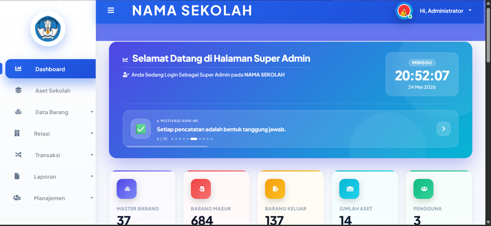
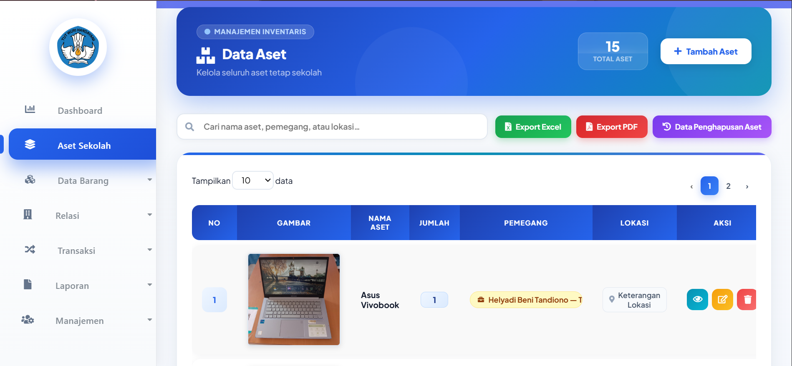
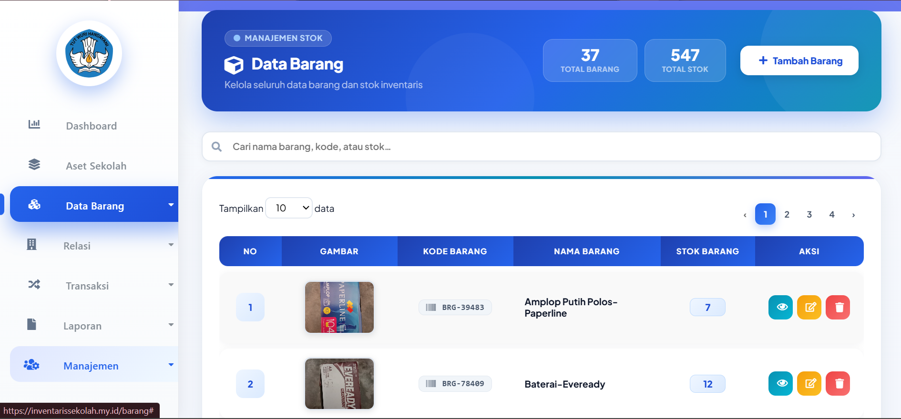
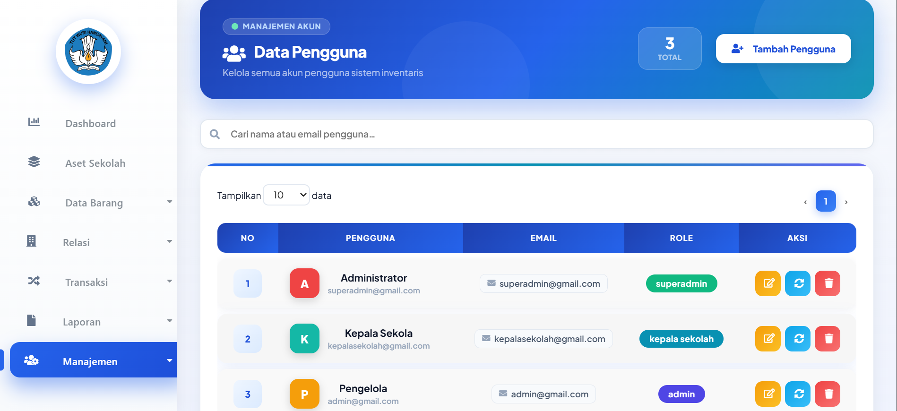
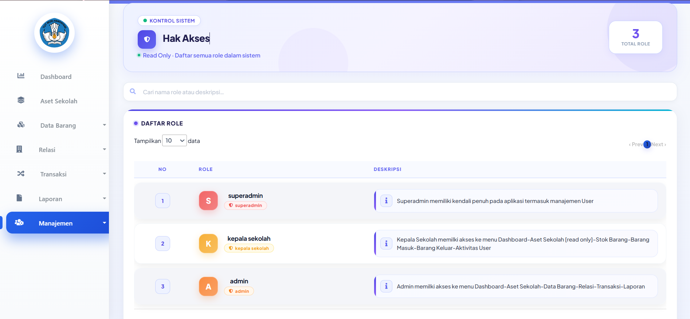
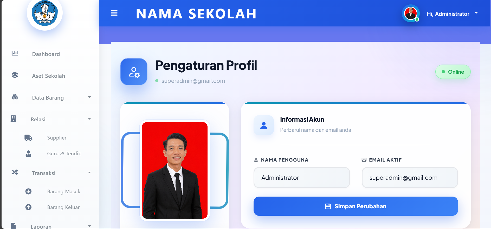
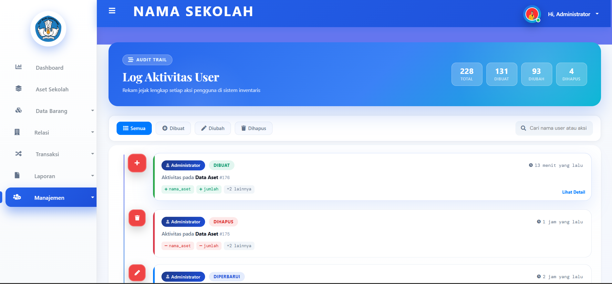

# Sistem Inventaris Sekolah Berbasis Web

Desain aplikasi dengan konsep  
## Modern, Transparan & Profesional  
untuk manajemen inventaris sekolah.

---

# ✨ Fitur Aplikasi

## 🔐 Keamanan & Akses Pengguna
- **Single Session**  
  Satu akun hanya dapat login dari satu perangkat pada saat bersamaan.

- **Reset Password & Reset Sesi Login**  
  Super Admin dapat mengelola akses pengguna dengan mudah.

- **Manajemen Pengguna & Role**  
  Mendukung berbagai role dan hak akses sesuai tanggung jawab masing-masing pengguna.

---

## 🏢 Manajemen Inventaris
- **Manajemen Aset Tetap**  
  Input aset baru, riwayat aset terhapus, serta export laporan PDF & Excel.

- **Manajemen Data Barang Bertahap**  
  Input kategori, satuan, kemudian data barang agar lebih terstruktur.

- **Kelola Data Relasi**  
  Manajemen data supplier serta data guru & tenaga kependidikan.

---

## 📦 Transaksi & Monitoring
- **Barang Masuk & Barang Keluar**  
  Pencatatan transaksi real-time dengan validasi stok minimal.

- **Pelaporan & Monitoring**  
  Tersedia 3 sub menu laporan:
  - Laporan Stok Barang
  - Laporan Barang Masuk
  - Laporan Barang Keluar

- **Monitoring Aktivitas User**  
  Super Admin dan Admin dapat melihat seluruh aktivitas pengguna dalam sistem.

---

## ✅ Validasi Sistem
- **Pencegahan Data Aset Ganda**  
  Sistem otomatis mendeteksi aset duplikat.

- **Validasi Data Barang**  
  Memastikan kategori, satuan, dan barang tetap unik.

- **Riwayat Penghapusan Aset**  
  Seluruh aset yang dihapus tercatat untuk audit trail.

- **Validasi Stok Minimal**  
  Sistem mencegah pengeluaran barang di bawah batas minimal.

---

## ⚙️ Konfigurasi & Bantuan
- **Custom Nama Instansi**  
  Super Admin dapat mengubah nama sekolah dan konfigurasi dasar sistem.

- **Panduan & Alur Penggunaan Sistem**  
  Membantu pengguna memahami cara kerja aplikasi secara lengkap.

---

# 🚀 Teknologi Yang Digunakan
- Laravel 12.x
- PHP 8.x
- MySQL
- Bootstrap / Tailwind CSS
- JavaScript
- Chart.js
- DomPDF
- Laravel Excel


## Installasi

Lakukan Clone Project/Unduh manual 

Buat database dengan nama 'inventarissekolah'

Jika melakukan Clone Project, rename file .env.example dengan env dan hubungkan
database nya dengan mengisikan nama database, 'DB_DATABASE=inventarissekolah'


Kemudian, Ketik pada terminal :
```sh
php artisan migrate
```

Lalu ketik juga

```sh
php artisan migrate:fresh --seed
```

Jalankan aplikasi 

```sh
php artisan serve
```

Akses Aplikasi di Web browser 
```sh
127.0.0.1:8000
```


## 📸 Tampilan Aplikasi

### 🏠 Dashboard


---

### 🏢 Manajemen Aset


---

### 📦 Data Barang


---

### 👥 Manajemen Pengguna


---

### 🔐 Manajemen Role & Hak Akses


---

### ⚙️ Pengaturan Sistem


---

### 📋 Aktivitas Pengguna



